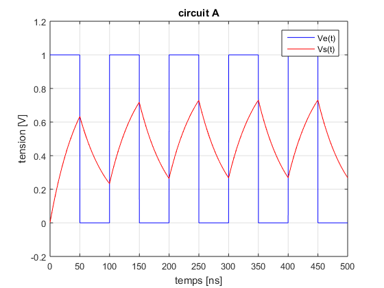
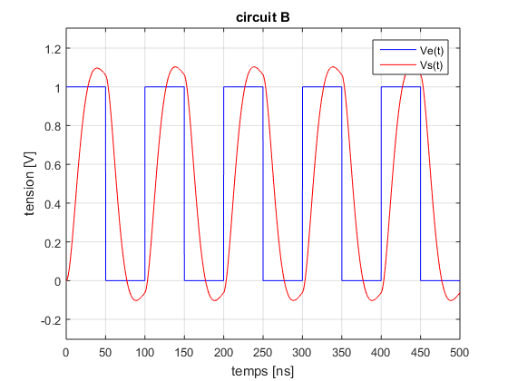
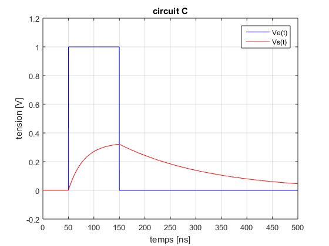
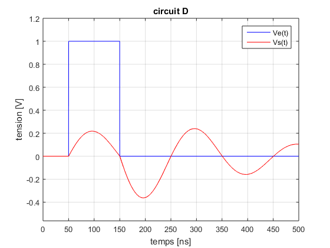
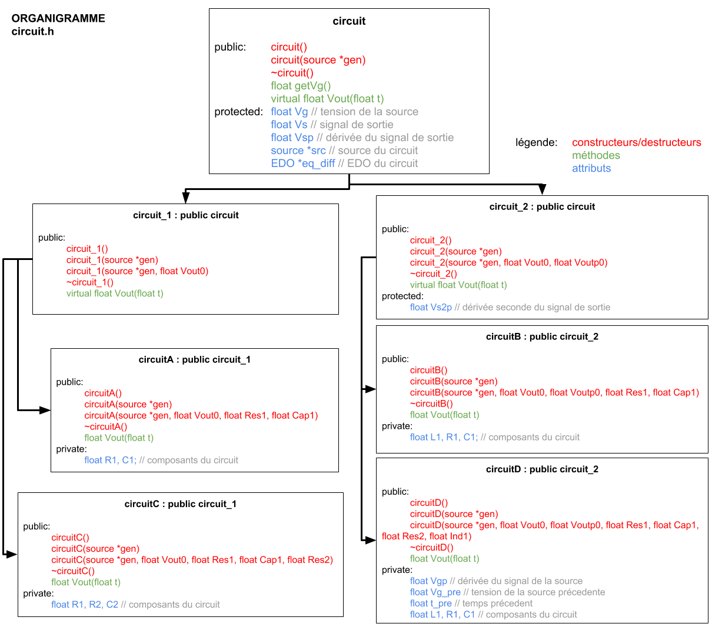
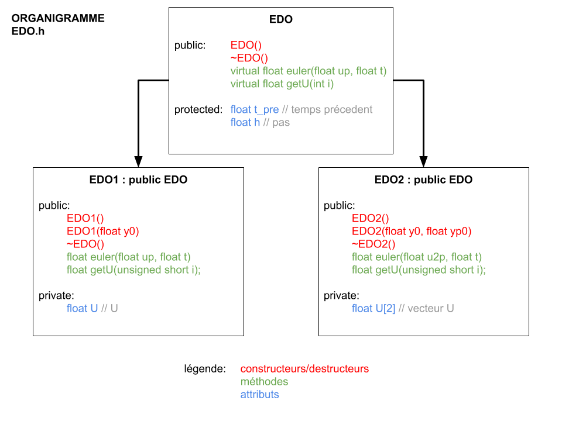
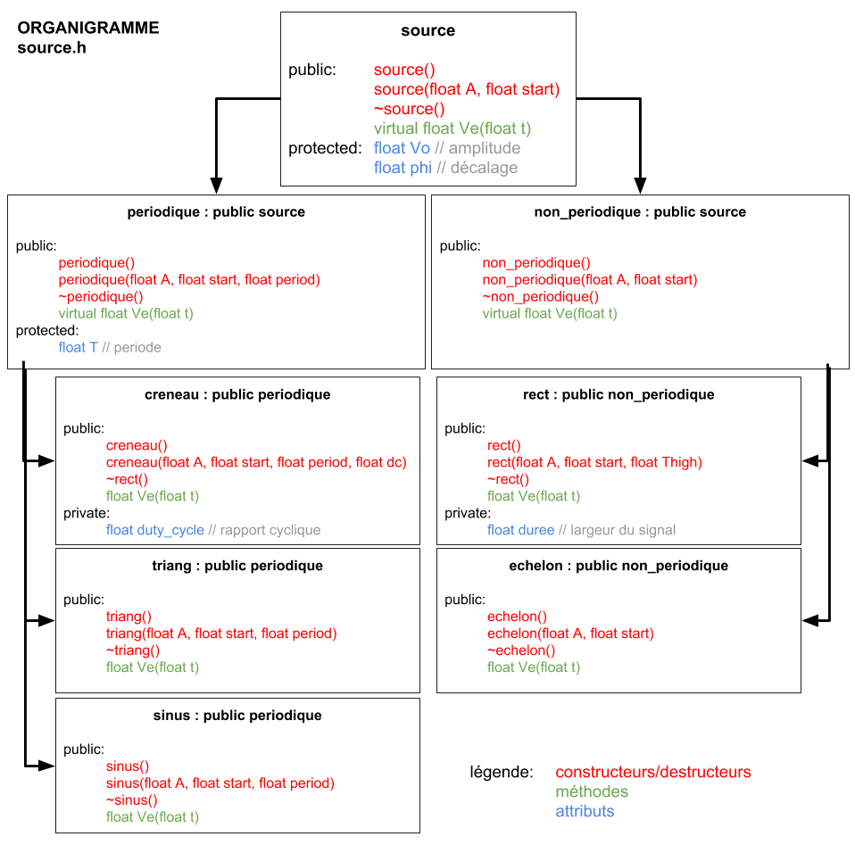
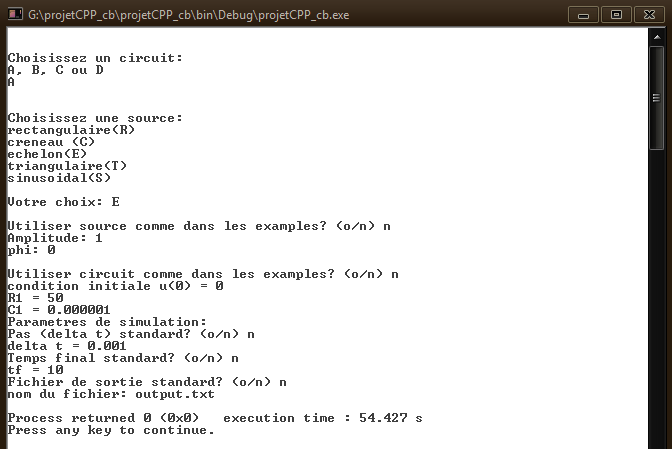

# Circuit Simulation in C++

C++ OOP lab sessions, 2nd year Electronics Engineering and Signal Processing at INP-ENSEEIHT

Solving electronic circuits differential equations in C++.

## Results

## Classes

### `circuit`
Models the different circuits.

### `EDO`
Ordinary differential equation solver.

### `source`
Models the different voltage sources.

## User menu

